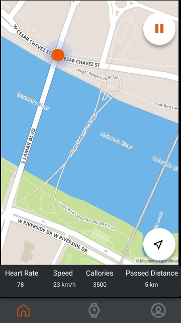

# SpikeBoost Client Part

Project stays in the active phaze of development. Android platform was chosen as a main test stand.

## Description
Client concept approximately looks:

Client side of SpikeBoost includes several screens to provide end user with next features:
1) stay authorized in system
2) gps navigation 
3) run/stop trainings
4) select music from tracks
5) Manage quality of neural network by its periodical update

## Technical Stack
1) Java 11 (since min Android SDK is 28)

## How To Run
WIP

## Testing
All tests are rotating around working with rest-end points. Last ones can be divided on couple groups:
1) user auth
2) music list setup
3) start of training activity (gps must be enabled)
4) sending of training data on server
5) receiving of updated neural-network and further its applying

## License
MIT
